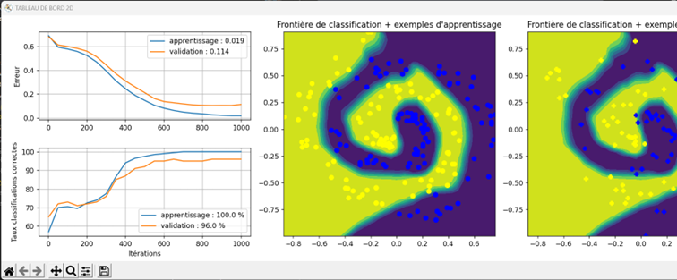
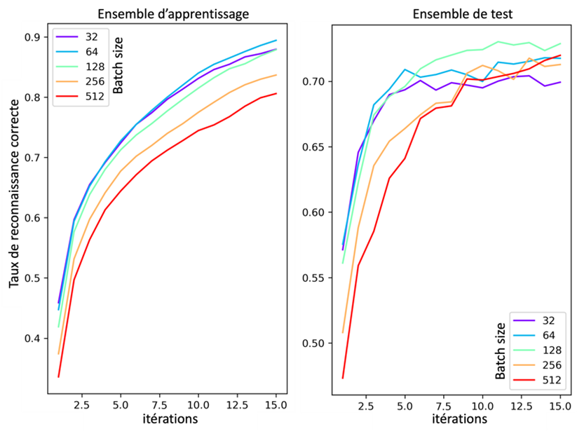
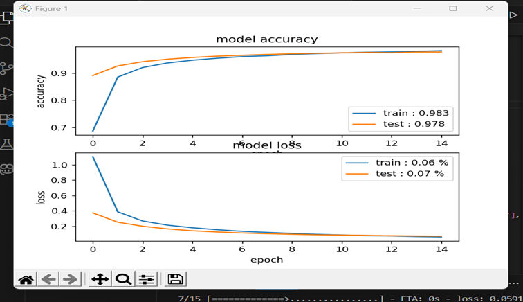

# 🔮 Deep Learning 2D Points Prediction & Hyperparameter Analysis

This repository contains a **deep learning** project that predicts 2D points using a **multi‑layer neural network (MLP)**. The goal is to study how different **hyperparameters** affect training performance, stability, and accuracy.

The project includes several visualizations: predicted vs real points, hyperparameter comparison diagrams, and accuracy evolution plots.

---

## 🚀 Project Overview

This project implements a deep learning pipeline to:

* Train a neural network for 2D point prediction
* Experiment with key hyperparameters
* Visualize the effect of batch size, learning rate, and number of iterations
* Compare different model configurations using diagrams and accuracy curves

---

## 🖼 Example Outputs

Include your generated images here:

1. **Predicted Points vs Real Points**

   

2. **Hyperparameter Comparison (Batch Size, Recognition Rate, Iterations)**

   

3. **Accuracy Curve Over Training Epochs**

   

---

## 👤 Author

**GHOUDDAN Khalil**

---

